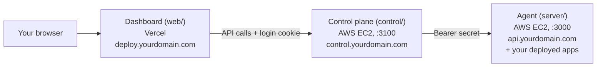

# Deploying Your Own Deployment Maintainer

A step-by-step guide to running your own copy: a dashboard at `https://deploy.yourdomain.com` that manages one or more servers and deploys your apps with one click.

**Time:** about 60–75 minutes the first time.

---

## The big picture

Three pieces, three domains:



| Piece | What it does | Where it runs | Example domain |
|---|---|---|---|
| **Dashboard** (`web/`) | The UI you log in to. Static files only. | **Vercel**, auto-deploys on every `git push` | `deploy.yourdomain.com` |
| **Control plane** (`control/`) | Admin login, list of servers and their secrets. Forwards your actions to the right agent. | **AWS EC2** (server 1) | `control.yourdomain.com` |
| **Agent** (`server/`) | Runs on every server you manage. Clones repos, runs the deploy pipeline, and serves your deployed apps through Nginx and PM2 at `https://<agent domain>/<app-name>/`. | **AWS EC2** (one per server) | `api.yourdomain.com` |

Server 1 runs both the control plane and its own agent. Extra servers run only an agent (Part 7).

> **Why Vercel for the dashboard?** It is only static files, so Vercel hosts it for free, gives it a CDN, and redeploys it automatically whenever you push. You can host it on the same EC2 instead (Appendix A), but you then rebuild and reload it by hand on every update.

> **Use one parent domain for all three names.** Login uses a `SameSite=Lax` cookie, which browsers send only between hosts under the same parent domain (`deploy.` and `control.` under `yourdomain.com`). A dashboard on a `*.vercel.app` address **cannot log in** to your control plane. Add your own domain to Vercel (step 2.4).

**You need:**
- an AWS account
- a **domain name** whose DNS you can edit (three names, plus one more per extra server)
- a GitHub account, and a Vercel account (the free plan is enough) signed in with GitHub
- a terminal with `ssh` (macOS/Linux, or Windows PowerShell)

**Contents:** [1 Before you start](#part-1-before-you-start) · [2 Dashboard on Vercel](#part-2-dashboard-on-vercel) · [3 AWS setup](#part-3-aws-setup) · [4 Agent](#part-4-agent-on-the-server) · [5 Control plane](#part-5-control-plane-on-server-1) · [6 Log in](#part-6-log-in-and-add-server-1) · [7 More servers](#part-7-add-another-server) · [8 First app](#part-8-deploy-your-first-app) · [9 Day-2](#part-9-day-2-operations) · [Appendix A](#appendix-a-host-the-dashboard-on-ec2-instead-of-vercel) · [Troubleshooting](#troubleshooting)

---

## Part 1: Before you start

### 1.1 Decide your domain names
Pick these now. Every later step uses them, written as placeholders:

| Placeholder | Example | Points to | Set up in |
|---|---|---|---|
| `YOUR_DASHBOARD_DOMAIN` | `deploy.yourdomain.com` | Vercel | step 2.4 |
| `YOUR_CONTROL_DOMAIN` | `control.yourdomain.com` | EC2 (server 1) | step 3.5 |
| `YOUR_SERVER_DOMAIN` | `api.yourdomain.com` | EC2 (server 1) | step 3.5 |

All three must be subdomains of the **same** parent domain (see the note above).

### 1.2 Fork the repo
You deploy your own copy, so changes you push redeploy your dashboard automatically.

- On GitHub open **`ashwinn-si/DeploymentMaintainer` → Fork** (or use `gh repo fork ashwinn-si/DeploymentMaintainer --clone`).
- Prefer a **private** copy? Clone the original, then `gh repo create deployment_maintainer --private --source . --push`. A fork of a public repo is always public; that is safe here because no secrets are committed, only `.env.example` files.

Below, `YOUR_USER/YOUR_REPO` means your copy, e.g. `YOUR_USER/DeploymentMaintainer`.

### 1.3 Create the GitHub token the agent uses
The agent uses this token to **list your repos and branches** and to **clone and pull the apps you deploy**. It only needs read access. Each server has its own `server/.env`, so reuse one token on every server or create one per server.

**Fine-grained token (recommended):**
1. GitHub → your avatar → **Settings → Developer settings → Personal access tokens → Fine-grained tokens → Generate new token**
2. **Token name:** `deployment-maintainer-ec2`
3. **Expiration:** up to 1 year. Put a calendar reminder to rotate it (see 9.4).
4. **Resource owner:** your account. (If your apps live in an **organization**, pick the org. It may need to approve the token under Org Settings → Personal access tokens.)
5. **Repository access:** **All repositories** (or "Only select repositories" if you prefer).
6. **Permissions → Repository permissions:**
   - **Contents: Read-only**
   - **Metadata: Read-only** (added automatically)
   - leave everything else at "No access"
7. **Generate token** and copy it (`github_pat_…`). GitHub shows it only once. Keep it for step 4.7.

**Classic token (only if you need repos from your personal account *and* an org in one token):**
Settings → Developer settings → Personal access tokens → **Tokens (classic)** → Generate new token → scope **`repo`**. Note: classic `repo` also grants write access, so it's broader than it needs to be.

The token lives only in `server/.env` on each EC2. It's never written into cloned repos, and it's masked in deploy logs.

---

## Part 2: Dashboard on Vercel

The dashboard only needs to know where the control plane lives, which is just a domain name, so you can deploy it before the backend exists. Until Part 5 is done it shows "Can't reach the server". That is expected.

### 2.1 Import the project
1. [vercel.com/new](https://vercel.com/new) → **Import** your fork (`YOUR_USER/YOUR_REPO`). Authorize the Vercel GitHub app if asked.
2. Configure the project:

| Setting | Value |
|---|---|
| Framework Preset | **Vite** (auto-detected) |
| **Root Directory** | **`web`** (click Edit and pick the `web` folder) |
| Build Command | leave default (`npm run build`) |
| Output Directory | leave default (`dist`) |
| Install Command | leave default |

`web/vercel.json` already makes every route fall back to `index.html`, so deep links and refreshes work.

### 2.2 Set the API address
Under **Environment Variables** add:

| Name | Value |
|---|---|
| `VITE_API_URL` | `https://YOUR_CONTROL_DOMAIN` (e.g. `https://control.yourdomain.com`) |

Origin only: `https://`, no trailing slash, no `/api`. The value is baked into the build, so after changing it you must **redeploy** (Deployments → ⋯ → Redeploy).

### 2.3 Deploy
Click **Deploy**. When it finishes you get a `*.vercel.app` preview address. The page will load but cannot log in yet; that needs your own domain (next step).

### 2.4 Add your domain
1. Project → **Settings → Domains → Add** → `YOUR_DASHBOARD_DOMAIN`.
2. Vercel shows the DNS record to create (for a subdomain, a **CNAME**, e.g. `deploy` → `cname.vercel-dns.com`; use the exact value Vercel displays). Add it at your DNS provider. If you use Cloudflare, set it to **DNS only** (grey cloud).
3. Wait until Vercel shows the domain as **Valid Configuration**. HTTPS is automatic.

### 2.5 Auto-deploy
From now on every push to your fork's `master` branch rebuilds and publishes the dashboard on its own. Pull-request branches get preview URLs, but those cannot log in (they are not on your domain and not in `CORS_ORIGINS`). Test UI changes locally instead (README → Local development).

---

## Part 3: AWS setup

This part is done in the AWS Console. It creates the machine that runs the control plane and the first agent.

### 3.1 Pick a region
Top-right region selector. Pick one close to your users (e.g. `ap-south-1` Mumbai) and use the same region for every step below.

### 3.2 Create the SSH key pair
This is how you log in to the server.

1. **EC2 → Network & Security → Key Pairs → Create key pair**
2. Name: `deployment-maintainer`, type **ED25519**, format **.pem**
3. Create. The browser downloads `deployment-maintainer.pem`. **This is the only copy.** If you lose it, you lose SSH access.
4. Move it somewhere safe and lock its permissions. SSH refuses keys that other users can read:

```bash
mkdir -p ~/.ssh
mv ~/Downloads/deployment-maintainer.pem ~/.ssh/
chmod 400 ~/.ssh/deployment-maintainer.pem
```

On Windows: right-click the file → Properties → Security, and remove every user except yourself.

### 3.3 Launch the EC2 instance
**EC2 → Instances → Launch instances**:

| Setting | Value |
|---|---|
| Name | `deployment-maintainer` |
| AMI | **Ubuntu Server 24.04 LTS** (or 22.04 LTS), 64-bit (x86) |
| Instance type | **t3.small** (2 GB RAM) recommended. `t3.micro` (1 GB) works for 1–2 small apps if you add swap (step 4.2). Go bigger for many apps or heavy builds. |
| Key pair | `deployment-maintainer` (from 3.2) |
| Storage | **30 GiB gp3**. Every app keeps its own `node_modules`, so disk fills faster than you'd expect. |

**Network settings → Edit → create a security group** named `deployment-maintainer-sg` with these inbound rules:

| Type | Port | Source | Why |
|---|---|---|---|
| SSH | 22 | **My IP** | only you can SSH in |
| HTTP | 80 | Anywhere (0.0.0.0/0) | needed for the certbot check and the HTTPS redirect |
| HTTPS | 443 | Anywhere (0.0.0.0/0) | the control plane, the agent API and your apps |

Do **not** open 3000, 3100, 4001+ or 27017. The agent, the control plane, your apps and MongoDB all stay private behind Nginx.

Click **Launch instance**.

> If your home IP changes later and SSH stops working, update the port 22 rule to your new IP (EC2 → Security Groups → `deployment-maintainer-sg` → Edit inbound rules).

### 3.4 Give it a fixed IP (Elastic IP)
Without this, the public IP changes every time the instance stops and starts, and your domains break.

1. **EC2 → Network & Security → Elastic IPs → Allocate Elastic IP address → Allocate**
2. Select it → **Actions → Associate Elastic IP address** → choose your instance → Associate.
3. Note the IP, e.g. `13.233.10.20`. It's used below as `YOUR_IP`.

> AWS bills public IPv4 addresses hourly. Release the Elastic IP if you ever terminate the instance.

### 3.5 Point the backend domains at it
At your DNS provider (Route 53, Cloudflare, GoDaddy, Namecheap, …) add **two A records**, both pointing at the same Elastic IP. (The dashboard's record was already created in 2.4.)

| Type | Name | Value | TTL | Used for |
|---|---|---|---|---|
| A | `control` (`control.yourdomain.com`) | `YOUR_IP` | 300 | the **control plane** (`YOUR_CONTROL_DOMAIN`) |
| A | `api` (`api.yourdomain.com`) | `YOUR_IP` | 300 | the **agent** and its deployed apps (`YOUR_SERVER_DOMAIN`) |

If you use Cloudflare, set both to **DNS only** (grey cloud) until certbot has finished (steps 4.12 and 5.4).

Check both from your machine (it can take a few minutes):
```bash
dig +short YOUR_CONTROL_DOMAIN     # should print YOUR_IP
dig +short YOUR_SERVER_DOMAIN      # should print YOUR_IP
```

### 3.6 Optional but recommended
- **Enable termination protection:** Instance → Actions → Instance settings → Change termination protection.
- **Enable automatic backups:** EC2 → Elastic Block Store → Lifecycle Manager → create a daily EBS snapshot policy for the instance's volume.
- **Set a billing alarm:** Billing → Budgets → create a monthly cost budget with an email alert.

---

## Part 4: Agent on the server

This part installs the **agent** and is repeated on every server you manage. Do it now on server 1. The control plane comes in Part 5.

### 4.1 SSH in
```bash
ssh -i ~/.ssh/deployment-maintainer.pem ubuntu@YOUR_IP
```
Type `yes` at the fingerprint prompt the first time. All remaining steps in Parts 4 and 5 run **on the server** as `ubuntu`.

Optional, to make SSH easier: add this to `~/.ssh/config` **on your Mac**, then just run `ssh dm`:
```
Host dm
  HostName YOUR_IP
  User ubuntu
  IdentityFile ~/.ssh/deployment-maintainer.pem
```

### 4.2 System packages (+ swap on small instances)
```bash
sudo apt update && sudo apt upgrade -y
sudo apt install -y git nginx build-essential unzip curl
```

On **t3.micro / 1–2 GB RAM**, add 2 GB of swap so `npm install` and builds don't get killed:
```bash
sudo fallocate -l 2G /swapfile
sudo chmod 600 /swapfile
sudo mkswap /swapfile
sudo swapon /swapfile
echo '/swapfile none swap sw 0 0' | sudo tee -a /etc/fstab
free -h     # Swap: 2.0Gi
```

### 4.3 Node.js via fnm
The agent uses fnm to give each app its own Node version.
```bash
curl -fsSL https://fnm.vercel.app/install | bash
source ~/.bashrc
fnm install 20
fnm default 20
node -v     # v20.x.x
```

Now pin PATH to fnm's **stable** default-alias directory. By default `node`/`npm`/`pm2` resolve through a temporary per-shell directory that disappears on reboot. PM2's boot script must not point there.
```bash
echo 'export PATH="$HOME/.local/share/fnm/aliases/default/bin:$PATH"' >> ~/.bashrc
source ~/.bashrc
which node  # must print /home/ubuntu/.local/share/fnm/aliases/default/bin/node
```

### 4.4 PM2 (+ log rotation)
```bash
npm install -g pm2
which pm2   # must print /home/ubuntu/.local/share/fnm/aliases/default/bin/pm2
pm2 install pm2-logrotate
pm2 set pm2-logrotate:max_size 10M
pm2 set pm2-logrotate:retain 7
```

### 4.5 MongoDB
MongoDB 8.0 (commands for Ubuntu 24.04 "noble"; on 22.04 replace `noble` with `jammy`):
```bash
curl -fsSL https://pgp.mongodb.com/server-8.0.asc | sudo gpg -o /usr/share/keyrings/mongodb-server-8.0.gpg --dearmor
echo "deb [ arch=amd64,arm64 signed-by=/usr/share/keyrings/mongodb-server-8.0.gpg ] https://repo.mongodb.org/apt/ubuntu noble/mongodb-org/8.0 multiverse" | sudo tee /etc/apt/sources.list.d/mongodb-org-8.0.list
sudo apt update
sudo apt install -y mongodb-org
sudo systemctl enable --now mongod
```
Check: `systemctl status mongod --no-pager` should show `active (running)`. MongoDB listens on `127.0.0.1` only by default. Leave it that way.

*(Alternative: skip this and use a MongoDB Atlas cluster. Put its connection string in `MONGO_URI` in steps 4.7 and 5.1, and allow `YOUR_IP` in Atlas → Network Access. Use a different database name for the agent and the control plane.)*

### 4.6 Clone your fork
Your fork is public (1.2), so a plain HTTPS clone works:
```bash
git clone https://github.com/YOUR_USER/YOUR_REPO.git ~/deployment_maintainer
cd ~/deployment_maintainer
mkdir -p ~/apps
```

<details>
<summary><b>Private copy? Use a read-only deploy key instead</b></summary>

Create an SSH key on the server that can read **only** this repo:
```bash
ssh-keygen -t ed25519 -C "ec2-deployment-maintainer" -f ~/.ssh/dm_deploy -N ""
cat ~/.ssh/dm_deploy.pub
```
Copy the printed line, then on GitHub: **your repo → Settings → Deploy keys → Add deploy key**. Title `ec2`, paste the key, leave "Allow write access" **unchecked**, and click Add key.

Back on the server:
```bash
cat >> ~/.ssh/config <<'EOF'
Host github.com
  IdentityFile ~/.ssh/dm_deploy
  IdentitiesOnly yes
EOF
chmod 600 ~/.ssh/config
ssh -T git@github.com          # answer "yes"; it says "Hi YOUR_USER/YOUR_REPO! ..."
git clone git@github.com:YOUR_USER/YOUR_REPO.git ~/deployment_maintainer
cd ~/deployment_maintainer
mkdir -p ~/apps
```
</details>

### 4.7 Configure `server/.env`
Every agent needs an **ID** and a **secret**. The control plane stores them and sends the secret as a bearer token with every request, so the agent has no login of its own. Normally you copy both from the dashboard's **Add Server** dialog (Part 7).

For **server 1** the dashboard can't add it yet, so generate temporary values now and enter the *same* values in Add Server later (step 6.2). Add Server has an "I already have an ID and secret" option for exactly this. Generate all three values on the server:
```bash
node -e "console.log(require('crypto').randomUUID())"                           # → SERVER_ID
node -e "console.log(require('crypto').randomBytes(32).toString('base64url'))"  # → SERVER_SECRET
node -e "console.log(require('crypto').randomBytes(32).toString('hex'))"        # → ENCRYPTION_KEY
```

```bash
cp server/.env.example server/.env
chmod 600 server/.env
nano server/.env
```
Set these values:

| Variable | Value |
|---|---|
| `PORT` | `3000` |
| `MONGO_URI` | `mongodb://127.0.0.1:27017/deployment_maintainer` (or your Atlas URI) |
| `SERVER_ID` | the generated UUID (8-64 characters: letters, digits, `_`, `-`), or the value from Add Server |
| `SERVER_SECRET` | the generated secret (32+ characters), or the value from Add Server |
| `ENCRYPTION_KEY` | the generated hex value (exactly 64 hex chars) |
| `GITHUB_TOKEN` | the token from step 1.3 |
| `APPS_DIR` | `/home/ubuntu/apps` |
| `NGINX_APPS_DIR` | `/etc/nginx/deployer-apps` |
| `APP_PORT_START` | `4001` |
| `DEFAULT_NODE_VERSION` | `20` |
| `NGINX_ENABLED` | `true` |
| `ANALYTICS_ENABLED` | `true` (optional; per-app request analytics, needs 4.11) |
| `ACCESS_LOG_DIR` | `/var/log/nginx/deployer` (optional; where the per-app Nginx access logs go, see 4.11) |
| `NODE_ENV` | `production` |
| `GIT_REMOTE_BASE` | `https://github.com` (leave as is) |

Save with `Ctrl+O`, Enter, `Ctrl+X`.

> **Back up `ENCRYPTION_KEY` and `SERVER_SECRET`** in a password manager. All app env vars in this server's database are encrypted with the key; if it's lost or changed, they can't be decrypted.

### 4.8 Install dependencies
```bash
npm ci
```
There is no admin user to create: the agent has no login. You don't need `npm run build` either, since the dashboard is on Vercel.

### 4.9 Nginx
Create the per-app routes folder, owned by `ubuntu` so the agent can write to it:
```bash
sudo mkdir -p /etc/nginx/deployer-apps
sudo chown ubuntu:ubuntu /etc/nginx/deployer-apps
```
Install the agent site, replacing `api.yourdomain.com` in the command with this server's real domain (`YOUR_SERVER_DOMAIN`):
```bash
sed "s/YOUR_SERVER_DOMAIN/api.yourdomain.com/g" deploy/nginx-server.conf \
  | sudo tee /etc/nginx/sites-available/deployment-maintainer > /dev/null
sudo ln -sf /etc/nginx/sites-available/deployment-maintainer /etc/nginx/sites-enabled/deployment-maintainer
sudo rm -f /etc/nginx/sites-enabled/default
sudo nginx -t          # must say "syntax is ok" and "test is successful"
sudo systemctl reload nginx
```
This site serves no UI: `/` is a 404 on purpose. It proxies only `/api/`, `/deployment-manager` and your deployed apps' paths.

### 4.10 Let the agent reload Nginx (sudoers)
The agent runs as `ubuntu`. It may run exactly two root commands without a password, `nginx -t` and `systemctl reload nginx`, and nothing else.
```bash
sudo visudo -cf deploy/sudoers-deployer
sudo cp deploy/sudoers-deployer /etc/sudoers.d/deployer
sudo chown root:root /etc/sudoers.d/deployer
sudo chmod 0440 /etc/sudoers.d/deployer
sudo -n nginx -t && echo "sudo rule OK"
```

### 4.11 Request logging for Analytics (optional)
The dashboard's **Analytics** page counts requests per app from Nginx access logs. The agent only writes `access_log` lines into an app's route if the log directory exists, so create it once (as `ubuntu`, readable by the agent and writable by Nginx's `www-data`) and add log rotation:
```bash
sudo install -d -o root -g ubuntu -m 2755 /var/log/nginx/deployer
sudo cp deploy/logrotate-deployer-nginx /etc/logrotate.d/deployer-nginx
sudo logrotate -d /etc/logrotate.d/deployer-nginx    # dry run, should print no errors
```
Then restart the agent if needed (`pm2 reload deployment-maintainer`), open **Analytics** in the dashboard and press **Enable request logging**. That rewrites each app's Nginx route with an `access_log` line and reloads Nginx. (Redeploying an app does the same for that app.) To turn the feature off set `ANALYTICS_ENABLED=false` in `server/.env`.

Things to know:
- Counts come from Nginx, so they include bots, crawlers and 404s (the status mix shows how many). Health checks that go straight to the app's port are not counted.
- The default `combined` log format has no latency, so there are no response-time charts.
- The 1-hour range is coarse: it uses hourly buckets (the current and previous hour).
- Hourly counters are kept in the agent's own MongoDB for 90 days; the raw logs are rotated weekly (4 kept).

### 4.12 HTTPS with certbot
DNS from step 3.5 must already resolve to `YOUR_IP`.
```bash
sudo snap install --classic certbot
sudo ln -sf /snap/bin/certbot /usr/bin/certbot
sudo certbot --nginx -d YOUR_SERVER_DOMAIN
```
Enter your email and agree to the terms. Certbot adds TLS and an HTTP → HTTPS redirect to the site, and sets up auto-renewal. Check renewal with `sudo certbot renew --dry-run`.

### 4.13 Start the agent under PM2 and survive reboots
```bash
cd ~/deployment_maintainer
pm2 start deploy/ecosystem.server.config.cjs
pm2 save
pm2 startup
```
`pm2 startup` prints a line starting with `sudo env PATH=...`. **Copy and run exactly that line.** Then:
```bash
pm2 save
pm2 status          # deployment-maintainer  online
curl -s localhost:3000/api/health    # {"ok":true}
```

### 4.14 Check the agent
The handshake endpoint is public. It tells the control plane which server it's talking to:
```bash
curl -s https://YOUR_SERVER_DOMAIN/deployment-manager
# {"service":"deployment-maintainer","serverId":"<your SERVER_ID>","version":"0.1.0"}
```
Everything under `/api/` needs the secret:
```bash
curl -s -o /dev/null -w "%{http_code}\n" https://YOUR_SERVER_DOMAIN/api/apps    # 401
curl -s -H "Authorization: Bearer $(grep ^SERVER_SECRET= server/.env | cut -d= -f2-)" https://YOUR_SERVER_DOMAIN/api/apps   # {"apps":[]}
```
`https://YOUR_SERVER_DOMAIN/` itself returns 404; that's expected.

On server 1, continue with Part 5. On another server, you're done with the agent: continue with Part 7.

---

## Part 5: Control plane (on server 1)

The control plane is the API behind the dashboard. Install it **only on server 1**, next to the agent. It shares the repo clone, Node, PM2, MongoDB and Nginx from Part 4, but has its own `.env`, database (`deployment_control`), port (`3100`), Nginx site and domain.

### 5.1 Configure `control/.env`
Generate two **different** secrets:
```bash
cd ~/deployment_maintainer
node -e "console.log(require('crypto').randomBytes(32).toString('hex'))"   # → JWT_SECRET
node -e "console.log(require('crypto').randomBytes(32).toString('hex'))"   # → ENCRYPTION_KEY
```
```bash
cp control/.env.example control/.env
chmod 600 control/.env
nano control/.env
```
Set these values:

| Variable | Value |
|---|---|
| `PORT` | `3100` |
| `MONGO_URI` | `mongodb://127.0.0.1:27017/deployment_control` (its own database, not the agent's) |
| `JWT_SECRET` | first generated value (32+ characters) |
| `ENCRYPTION_KEY` | second generated value (exactly 64 hex chars). Not the same key as in `server/.env`. |
| `ADMIN_EMAIL` | the email you'll log in with |
| `ADMIN_PASSWORD` | a strong password, 12+ characters |
| `NODE_ENV` | `production` |
| `CORS_ORIGINS` | **`https://YOUR_DASHBOARD_DOMAIN`**, the Vercel dashboard (e.g. `https://deploy.yourdomain.com`). Exact origin: `https://`, no path, no trailing slash. Comma-separate several. Without it the browser blocks every call from the dashboard. |
| `ALLOW_INSECURE_SERVER_URLS` | `false` (leave as is; server URLs must be `https://`) |

> **Back up `ENCRYPTION_KEY`** in a password manager. The control plane stores each server's secret encrypted with it. If it's lost, you have to re-add your servers.

### 5.2 Install and create the admin user
```bash
npm ci
npm run seed        # → "Created admin user you@example.com."
```
`npm run seed` at the repo root runs the control plane's seed. There is no `npm run build` here: the dashboard is built by Vercel.

### 5.3 Nginx site for the control plane
```bash
sed "s/YOUR_CONTROL_DOMAIN/control.yourdomain.com/g" deploy/nginx-control.conf \
  | sudo tee /etc/nginx/sites-available/deployment-control > /dev/null
sudo ln -sf /etc/nginx/sites-available/deployment-control /etc/nginx/sites-enabled/deployment-control
sudo nginx -t
sudo systemctl reload nginx
```

### 5.4 HTTPS for the control domain
DNS for `YOUR_CONTROL_DOMAIN` (step 3.5) must already resolve to `YOUR_IP`. Certbot is already installed from 4.12.
```bash
sudo certbot --nginx -d YOUR_CONTROL_DOMAIN
```
This adds a second certificate; auto-renewal covers both.

### 5.5 Start the control plane under PM2
```bash
cd ~/deployment_maintainer
pm2 start deploy/ecosystem.control.config.cjs
pm2 save
pm2 status          # deployment-maintainer and deployment-control, both online
curl -s localhost:3100/api/health    # {"ok":true}
```
`pm2 startup` was already set up in 4.13, so `pm2 save` is all that's needed to include the new process on reboot.

### 5.6 Check it from outside
From your own machine, simulating a request from the dashboard:
```bash
curl -si -H "Origin: https://YOUR_DASHBOARD_DOMAIN" https://YOUR_CONTROL_DOMAIN/api/health
```
You should see `200`, `{"ok":true}`, and the headers `access-control-allow-origin: https://YOUR_DASHBOARD_DOMAIN` and `access-control-allow-credentials: true`. If those two headers are missing, `CORS_ORIGINS` is wrong or the control plane wasn't reloaded (`pm2 reload deployment-control`).

`https://YOUR_CONTROL_DOMAIN/` itself shows "Cannot GET /"; that's expected because this host is the API only.

---

## Part 6: Log in and add server 1

### 6.1 Log in
Open **`https://YOUR_DASHBOARD_DOMAIN`** (the Vercel one) and log in with `ADMIN_EMAIL` / `ADMIN_PASSWORD`.

Login only works over **https**, because the session cookie is marked Secure in production. The agent domain has no login at all.

### 6.2 Add server 1
**Servers → Add Server**:
1. **Details:** a name (e.g. `server-1`) and the URL `https://YOUR_SERVER_DOMAIN`. This is the **agent's** domain, not the control plane's.
2. **Configure the server:** turn on **"I already have an ID and secret"** and paste the `SERVER_ID` and `SERVER_SECRET` from `server/.env` (step 4.7).
3. **Verify & add.** The control plane calls `/deployment-manager`, checks the ID matches, then checks the secret. The server should show **online**.

Open it, then **Settings**: the GitHub card should show your GitHub username. If it shows an error, the token in `server/.env` is wrong (see 9.4).

### 6.3 Reboot test
Make sure both processes survive a reboot:
```bash
sudo reboot
# wait ~1 minute, SSH back in
pm2 status          # deployment-maintainer and deployment-control should be online again
```

---

## Part 7: Add another server

Each extra server is its own EC2 with its own agent, apps and MongoDB. It does **not** run a control plane or a dashboard; the ones you already have manage it.

1. **Part 3** for the new EC2: key pair (or reuse one), instance, security group, Elastic IP. Add **one DNS A record** for it, e.g. `api2` → the new IP. That name is its `YOUR_SERVER_DOMAIN`.
2. **Part 4**, steps 4.1 to 4.12, on the new server. If you use a deploy key (4.6), generate a new one on this server and add it to the repo's Deploy keys too (GitHub won't accept the same key twice). Give it a `GITHUB_TOKEN`. Skip Part 5. In 4.7, copy `.env.example` and fill everything except `SERVER_ID` and `SERVER_SECRET`, which come next. Don't start PM2 yet.
3. In the dashboard: **Servers → Add Server**. Enter a name and `https://api2.yourdomain.com`. The dialog generates a `SERVER_ID` and `SERVER_SECRET` and shows them as a `.env` snippet.
4. Paste the two lines into the new server's `server/.env`, then run step 4.13 there (`pm2 start deploy/ecosystem.server.config.cjs`, `pm2 save`, `pm2 startup`). If the agent was already running, `pm2 reload deployment-maintainer` instead.
5. Back in the dialog, click **Verify & add**. The server should show **online**.

Use the sidebar's server switcher to move between servers. Each server has its own apps, deployments, ports and settings.

---

## Part 8: Deploy your first app

### 8.1 What your app needs
- It must **listen on `process.env.PORT`**. The agent assigns the port and writes it into `.env` and PM2's env.
- It needs a **start command**; the default is `npm start`. If it needs a build first, enable the Build step.
- The **health check is off by default**. If you turn it on in the Steps tab, your app needs a `GET /health` endpoint (path is configurable) that returns 2xx/3xx on `process.env.PORT` within 60s of starting; otherwise the deploy fails and auto-rolls back. The Steps tab shows a copy-paste prompt for adding that endpoint. The background health monitor is also off; set `HEALTH_MONITOR=true` in `server/.env` to enable it.
- **Path prefix:** at `https://YOUR_SERVER_DOMAIN/my-api/users`, the app receives just `/users` (the prefix is stripped by default). APIs work unchanged. Apps that render HTML with absolute links (`/css/app.css`) will break under a prefix; turn off "strip prefix" and make the app aware of its base path, or keep such apps API-only.
- If it reads env vars from a `.env` file, use `dotenv`. The agent writes `.env` into the app folder. The vars are also passed directly in the process environment.

### 8.2 Create and deploy
Apps live on a specific server, so first open the server in the dashboard (pick it on the Servers page or in the sidebar switcher).

1. **New App** → pick the repo → pick the branch.
2. **Name** becomes the URL path and folder, e.g. `my-api` → `https://YOUR_SERVER_DOMAIN/my-api/` (on that server's domain, not the dashboard's). Use lowercase letters, numbers and dashes. These names are reserved: `api, deployment-manager`.
3. **Port** is auto-filled (4001, 4002, …).
4. **Node version** is detected from `.nvmrc` / `package.json` `engines`, or defaults to 20.
5. **Environment:** add variables, or paste a whole `.env`.
6. **Steps:** leave the defaults for a standard Node API. Turn on Build if needed, add custom steps (e.g. `npx prisma migrate deploy`), and adjust the health-check path.
7. **Create & Deploy.** You'll see the live log. When it's green, open `https://YOUR_SERVER_DOMAIN/my-api/`.

**Same repo, another branch:** create another app (e.g. `my-api-dev` on `dev`) with its own env, or use **Duplicate** on the app page.

**Later deploys:** the **Deploy** button → choose a branch → **Update** (pull, rebuild, restart the PM2 process) or **Fresh** (re-clone from scratch and start a new process). By default both are *staged*: the new version is built and smoke-tested in `<app>.staging` while the live one keeps serving, and only swapped in if that passes; if it fails after the swap, the previous version is restored automatically (Overview → Staged deploys turns this off).

**Monorepo?** In New App, **Root directory** lets you deploy a sub-folder (e.g. `apps/web`) of a repo; leave it at `/` for the whole repo. **Commits** on the app page shows the commits around the deployed one; **Analytics** (server menu) shows traffic per app (needs 4.11).

**Something broke?** Deployments → pick an earlier successful deploy → **Rollback to this**.

---

## Part 9: Day-2 operations

### 9.1 Updating
Pull the latest changes into your fork (GitHub → **Sync fork**, or `git pull upstream master` locally and push). Then:

- **Dashboard (Vercel):** nothing to do. The push redeploys it automatically. Check **Deployments** in Vercel if the UI looks stale.
- **Control plane (server 1):** `git pull`, `npm ci`, `pm2 reload deployment-control`.
- **Every agent:** `git pull`, `npm ci`, run the migrations below, then `pm2 reload deployment-maintainer`.

Agents have database migrations, which you **rehearse on a copy of the real data before applying**:
```bash
cd ~/deployment_maintainer
git pull
npm ci

# 1. Dry run: copies the live database into a throwaway one, migrates the copy, validates every
#    document and tests down + up again. It only READS the real database and drops the copy at the end.
npm run migrate:status -w server      # lists pending migrations (changes nothing)
npm run migrate:dry-run -w server     # must end with: DRY RUN PASSED

# 2. Only if the dry run passed: apply them for real (each one backs up what it touches to server/backups/)
npm run migrate:up -w server
npm run migrate:status -w server      # everything should now say the migration's applied date

pm2 reload deployment-maintainer
```
If the dry run ends with `DRY RUN FAILED — do NOT migrate production`, stop: read the reasons, don't run `migrate:up`, and fix or report it (the old code keeps working; the new code reads new fields with defaults, so deploying it before migrating is safe). Do an **Export** (9.2) before the first migration on a live server. To undo the last migration: `npm run migrate:down -w server`. The dry run needs free disk for a second copy of the database. See `server/migrations/README.md`.

On **server 1**, also reload the control plane (its database has no pending migrations today; `npm run migrate:dry-run` is agent-only):
```bash
pm2 reload deployment-control
```
Avoid updating while an app deploy is running. An interrupted deploy is marked failed; just redeploy it (a half-built staging folder or a half-done folder swap is cleaned up/repaired when the agent starts). Reloading the control plane only drops open log streams; reload the page and they resume.

Disk note: staged deploys (on by default, see Part 8) need room for a second copy of the app while a deploy runs (`<app>.staging`, then the old version as `<app>.previous` until the deploy has fully passed). Once it passes the old copy is deleted, so at rest each app takes its normal size. A deploy fails early with a clear message if there isn't enough free space.

### 9.2 Backups
- **App configs:** open the server in the dashboard → Settings → Backup → **Export** (passphrase-encrypted JSON). Do it per server, and keep the file somewhere off the server.
- **Databases:** on each server `mongodump --db deployment_maintainer --out ~/backup-$(date +%F)`. On server 1, also back up the control plane: `mongodump --db deployment_control --out ~/backup-$(date +%F)`. Copy them off the box: `scp -i ~/.ssh/deployment-maintainer.pem -r ubuntu@YOUR_IP:~/backup-* .`
- **Whole disk:** the EBS snapshots from 3.6.
- Keep each `server/.env` (especially `ENCRYPTION_KEY` and `SERVER_SECRET`) and `control/.env` (especially `ENCRYPTION_KEY`) in your password manager.

### 9.3 Forgot the dashboard password or rotate a server secret
**Forgot the dashboard password** (on server 1; the admin account lives in the control plane):
```bash
cd ~/deployment_maintainer/control
nano .env               # set a new ADMIN_PASSWORD
npm run seed            # resets it and logs out all sessions
```
You can also change it while logged in under **Account**.

**Rotate a server's secret:**
1. In the dashboard: Servers → the server's menu → **Rotate secret**. It generates a new `SERVER_SECRET` and shows it as a snippet.
2. Put the new value in that server's `server/.env` and reload: `pm2 reload deployment-maintainer`.
3. Back in the dialog, click **Verify**. Until the agent has the new secret, the dashboard still holds the old one.

### 9.4 Rotate or replace the GitHub token
Create a new token (1.3), put it in that server's `server/.env` as `GITHUB_TOKEN`, then:
```bash
pm2 reload deployment-maintainer
```
Open the server in the dashboard → Settings, which should show your GitHub username again. Delete the old token on GitHub.

### 9.5 Change a domain
- **Dashboard domain:** update `CORS_ORIGINS` in `control/.env` (`pm2 reload deployment-control`).
- **Control domain:** update `VITE_API_URL` in Vercel and redeploy, and rerun 5.3 and 5.4 for the new name.
- **Agent domain:** rerun 4.9 and 4.12 for the new name, then edit the server's URL in the dashboard.

### 9.6 Useful commands
```bash
pm2 status                              # all processes (apps are named app-<name>)
pm2 logs deployment-maintainer --lines 100   # the agent
pm2 logs deployment-control --lines 100      # the control plane (server 1)
pm2 logs app-my-api --lines 100
ls /etc/nginx/deployer-apps/            # one .conf per routed app
sudo nginx -t
df -h /                                 # disk space
curl -s https://YOUR_SERVER_DOMAIN/deployment-manager   # is the agent reachable from outside?
```

---

## Appendix A: Host the dashboard on EC2 instead of Vercel

Not recommended: you lose automatic deploys and must rebuild by hand on every update. It does save you the Vercel account and one domain, because the control plane serves the UI itself on a single domain.

Replace Parts 2, 5.1 (`CORS_ORIGINS`), 5.2 and 5.6 with:

1. **DNS:** in 3.5, create only `control` (call it `YOUR_CONTROL_DOMAIN`) and `api`. There is no `YOUR_DASHBOARD_DOMAIN`; you log in at `https://YOUR_CONTROL_DOMAIN`.
2. **`control/.env`:** leave `CORS_ORIGINS` empty. The UI and API share one origin.
3. **Build the UI** on the server, after `npm ci` in 5.2:
   ```bash
   npm run build       # builds web/dist, which the control plane serves
   ```
   The control plane serves `web/dist` when it exists. If you build after step 5.5, run `pm2 reload deployment-control`.
4. Everything else (5.3 to 5.5, Part 6 using `https://YOUR_CONTROL_DOMAIN`) is unchanged.
5. **Updating:** in 9.1, run `npm run build` and `pm2 reload deployment-control` on server 1 after every `git pull`.

---

## Troubleshooting

### Dashboard and login

| Symptom | Fix |
|---|---|
| Dashboard says "Can't reach the server" | The control plane isn't reachable from the browser. Check `curl -s https://YOUR_CONTROL_DOMAIN/api/health`, `pm2 status`, and that `VITE_API_URL` in Vercel is exactly `https://YOUR_CONTROL_DOMAIN` (then **redeploy** Vercel, since it's baked into the build). |
| Browser console shows a CORS error | `CORS_ORIGINS` in `control/.env` doesn't exactly match the dashboard's origin (scheme + host, no trailing slash). Fix it and `pm2 reload deployment-control`. Re-check with 5.6. |
| Login succeeds, then you're sent back to the login page | The cookie isn't being kept: the dashboard and control plane are not under the same parent domain (e.g. you're on `*.vercel.app`), or you're on `http://`. Use `YOUR_DASHBOARD_DOMAIN` over https (step 2.4). |
| Login says "Origin not allowed" (403) | You opened the dashboard from an address that isn't in `CORS_ORIGINS` (a Vercel preview URL, or a second domain). Add it to `CORS_ORIGINS`, or use the main domain. |
| Vercel build fails at install | Make sure **Root Directory** is `web`. If it still can't find the workspace packages, set Install Command to `cd .. && npm ci`. |
| Dashboard works but is stale after a push | Check Vercel → Deployments for a failed build. Production deploys from your fork's `master` branch. |
| Live logs don't stream (they appear all at once) | Something is buffering. Both Nginx sites need their SSE blocks: `/api/servers/` in `nginx-control.conf` and `/api/deployments/` in `nginx-server.conf`, each with `proxy_buffering off`. Also turn off Cloudflare proxying for both hosts. |

### Servers and the agent

| Symptom | Fix |
|---|---|
| Server shows **unauthorized** | The agent's `SERVER_SECRET` no longer matches what the dashboard stored (`.env` edited, or the agent restarted from another `.env`). Rotate it (9.3), or put the right value back in `server/.env` and `pm2 reload deployment-maintainer`. |
| Add Server says "Server ID mismatch" | `SERVER_ID` in that server's `.env` differs from the ID you entered. Make them identical, then `pm2 reload deployment-maintainer` and Verify again. |
| Add Server says the secret was rejected | `SERVER_SECRET` in `.env` differs from the one entered, or the agent wasn't reloaded after you edited `.env`. |
| Server shows **offline** / "Could not reach the server" | The agent is down (`pm2 status` on that server), DNS or TLS for its domain isn't set up, or Nginx isn't proxying `/deployment-manager`. Check `curl -s https://YOUR_SERVER_DOMAIN/deployment-manager` from outside. |
| "That URL is not a Deployment Maintainer server" | The URL points at the control plane or something else. Use the **agent's** domain (`api...`), not the control or dashboard domain. |
| Dashboard works but a server's page shows "rejected the stored secret" | Same as *unauthorized* above: the proxy got a 401 from the agent. Rotate the secret. |
| Server Settings → GitHub shows an error, New App can't list repos | `GITHUB_TOKEN` in that server's `.env` is missing, expired or lacks access. Redo 1.3 and 9.4. For org repos, the org may need to approve the token. |

### AWS, SSH and HTTPS

| Symptom | Fix |
|---|---|
| `ssh: Permission denied (publickey)` | Wrong key or user. Use `-i ~/.ssh/deployment-maintainer.pem` and `ubuntu@`. The `.pem` must be `chmod 400`. |
| SSH times out | Your IP changed. Update the port 22 rule (step 3.3 note). |
| Certbot fails with "connection refused" / "timeout" | DNS for that domain doesn't point at `YOUR_IP` yet, port 80 isn't open, or Cloudflare proxy is on. Each domain needs its own certbot run (4.12, 5.4). |
| Dashboard or agent doesn't come back after reboot | `pm2 startup`'s printed command wasn't run, or PATH wasn't pinned (4.3). Fix PATH, then rerun `pm2 startup`, its printed command, and `pm2 save`. |
| `npm install` killed / exit code 137 | Out of memory. Add swap (4.2) or use a bigger instance. |
| Disk full | Server page shows usage per app. Delete unused apps from the UI (not with `rm -rf`), and enlarge the EBS volume if needed. |

### Deploying apps

| Symptom | Fix |
|---|---|
| Deploy fails at `sudo` / nginx step | The sudoers rule isn't installed exactly on that server. Redo 4.10; `sudo -n nginx -t` must work without a password. |
| Deploy fails at the health check | The app isn't listening on `process.env.PORT`, crashes on start, or the health path returns 4xx/5xx. Check App → Runtime logs. |
| Changed an app's start command but it still runs the old one | `pm2 delete app-<name>`, then deploy again (known limitation). |
