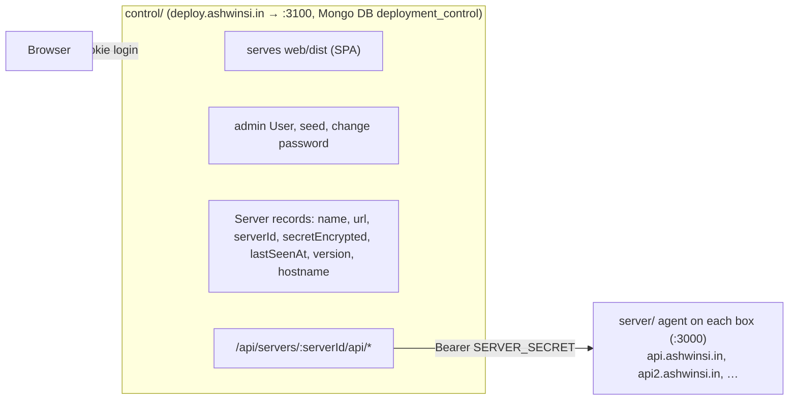

# Deployment Maintainer

A self-hosted "mini-Vercel" for your own EC2 instances: log in to one dashboard, pick a server, pick a
GitHub repo and branch, configure env vars and a deploy pipeline, and deploy. Every later deploy is one
click with live logs, health checks, one-click rollback, and Nginx path-based routing (`/my-app` → its
own port). The same repo can be deployed many times as independent apps, each with its own branch, port,
env and steps. One dashboard manages any number of servers.

## Architecture

A **control plane** (the dashboard) manages one or more **agents**, one per server. The browser only ever
talks to the control plane. It owns the admin login and stores each server's URL, ID and encrypted secret
in its own MongoDB database, then forwards requests to the right agent with a bearer secret. Agents have
no users and no UI, and need no CORS.



Each agent keeps its own apps and deployments in its own MongoDB, runs the deploy pipeline, and serves the
deployed apps through its own Nginx. Adding a server in the dashboard generates a `SERVER_ID` and
`SERVER_SECRET` that you paste into that agent's `server/.env`; the dashboard then calls the agent's
`GET /deployment-manager` and checks the ID and secret before registering it.

## Features

- Manage many servers from one dashboard: add, rename, change URL, rotate a secret, remove; per-server
  status (online, offline, secret rejected) and a server switcher
- GitHub repo/branch picker, per-app Node version (via [fnm](https://github.com/Schniz/fnm))
- Configurable deploy pipeline: git sync, install, build, PM2 start or restart, health check, Nginx routing,
  plus arbitrary custom steps
- Three app types, auto-detected from the repo: Node servers (PM2), frontend apps (Vite, React, Astro... built then served by Nginx) and plain static HTML. Static types need no process or port and are served from `PUBLISHED_DIR`
- Deploy any branch on demand (update in place or fresh re-clone); duplicate an app to run another branch side by side
- Live streaming deploy logs (SSE) on the home page, a global Deployments page and a per-deploy detail view, with step timeline, cancel, copy and download; secrets are masked
- **Staged deploys** (on by default): each deploy builds and smoke-tests in `<app>.staging` while the live version keeps serving, checks disk space first, swaps the folder in only on success and restores the previous version automatically if something fails after the swap (the old copy is deleted once the deploy has fully passed, so only one copy stays on disk)
- PM2 step **starts** a new process on a new app or fresh deploy and **restarts** the existing one on updates (recreating it if the start command, folder or Node version changed)
- **Root directory** per app (like Vercel): deploy a sub-folder of a monorepo, picked with a GitHub folder browser
- A `PORT` set in the environment variables becomes the app's port (otherwise the assigned port is injected as `PORT`)
- App page: **Commits** timeline around the deployed commit (what is live, what is not yet deployed), runtime logs split into Output and Errors
- **Analytics**: requests per app over time, status mix and busiest hours, from per-app Nginx access logs (stored on each agent)
- Auto-rollback on a failed health check (in-place deploys), one-click manual rollback to any past successful deploy
- Server health (CPU/RAM/disk with 1h history, per-app memory and disk use, app health pings) and a ports/routing overview
- Per-server settings (GitHub token status, passphrase-encrypted config export/import) and an account page to change the dashboard password

## Local development

Requires Node 20+ and a MongoDB instance (local or Docker). The test suites expect MongoDB on
`127.0.0.1:27017` and use fake `pm2`/`fnm`/`sudo` executables, so neither needs installing to run
tests. Running real deploys locally does need `fnm` and `pm2`.

1. Start MongoDB, then `npm install`.
2. Agent: `cp server/.env.example server/.env` and set `SERVER_ID=local-server-1`, a `SERVER_SECRET` of 32+
   characters, `ENCRYPTION_KEY`, `NGINX_ENABLED=false` (the nginx step then just logs "skipped"), and
   `APPS_DIR` / `NGINX_APPS_DIR` under `./.data`. `GITHUB_TOKEN` is optional until you need to list real repos.
3. Control plane: `cp control/.env.example control/.env` and set its own `JWT_SECRET`, `ENCRYPTION_KEY`,
   `ADMIN_EMAIL` and `ADMIN_PASSWORD`, with `MONGO_URI` on the `deployment_control` database.
4. Create the admin user and start everything (three terminals):

```bash
npm run seed            # creates the admin user from control/.env
npm run dev             # agent on :3000
npm run dev:control     # control plane on :3100
npm run dev:web         # frontend (Vite) on :5173, proxies /api to :3100
```

5. Open `http://localhost:5173`, log in, and **Add Server** with `http://localhost:3000`. In the second
   step use **"I already have an ID and secret"** and enter the `SERVER_ID` and `SERVER_SECRET` from `server/.env`.

Run all test suites with `npm test`.

## Project layout

```
server/    Agent API: deploy pipeline (src/steps, src/services: deployer, staging, smoke, analytics), bearer auth,
           migrations/ (migrate-mongo), scripts/ (clear-db, migrate-dry-run, drift-check), .mongoose-drift/ (schema snapshots), tests
control/   Control plane: admin login, server registry, authenticated proxy, serves web/dist, scripts/seed + clear-db + drift-check,
           .mongoose-drift/ (schema snapshots), tests
web/       React + Vite + Tailwind dashboard (styled per style.md)
deploy/    Nginx sites (agent + control plane), sudoers rule, PM2 ecosystems (see DEPLOYMENT.md)
docs/      API reference (control plane API and agent API)
AGENTS.md  Rules for contributors and AI agents (repo map, commands, database migration rules)
style.md   UI design system
```

## Production deployment

See **[DEPLOYMENT.md](DEPLOYMENT.md)**: AWS setup (key pair, EC2, security group, Elastic IP, DNS), the
GitHub token, the agent install on each server (fnm, PM2, MongoDB, Nginx, sudoers, certbot), the control
plane on server 1, adding more servers, and deploying your first app.

## Scripts (repo root)

| Script | What it does |
| --- | --- |
| `npm run dev` | Agent dev server (`node --watch`, `server/`) |
| `npm run dev:control` | Control plane dev server (`node --watch`, `control/`) |
| `npm run dev:web` | Frontend dev server (Vite) |
| `npm start` | Agent in production mode |
| `npm run start:control` | Control plane in production mode (serves the built frontend) |
| `npm run seed` | Creates/resets the admin user from `control/.env` |
| `npm run clear-db` | Drops the agent's database (typed confirmation, or `--yes`) |
| `npm run clear-db:control` | Drops the control plane's database (typed confirmation, or `--yes`) |
| `npm run build` | Builds the frontend to `web/dist`, served by the control plane |
| `npm test` | Runs every workspace's test suite |
| `npm run migrate:status -w server` | Lists pending database migrations |
| `npm run migrate:dry-run -w server` | Rehearses pending migrations on a throwaway copy of the real data (never writes to the real DB) |
| `npm run migrate:up -w server` / `migrate:down -w server` | Applies / reverts migrations (run the dry run first on a live server) |
| `npm run drift:check -w server` (or `-w control`) | Fails if the Mongoose models changed without a new schema snapshot + migration |

## Known limitations

- **Control plane shares server 1's box**: if server 1 is down, the dashboard is too, even though other servers keep running their apps.
- **Restart on update**: the PM2 step starts a new process on a new app or fresh deploy, and restarts the existing one on an update or rollback. If the start command, working directory or Node version changed since the last deploy, it deletes and recreates the process instead, so the new definition applies (the deploy log says which).
- **Single process only**: the deploy lock is in memory, so never run the agent (or the control plane) in pm2 cluster mode or as multiple instances.
- **Not yet verified on a real server**: pipeline tests use fake `pm2`/`fnm`/`sudo`, and several pages were only checked against the dev mock. Treat the first EC2 deploy as the integration test.
- **Secrets**: app env is encrypted in MongoDB but written in plaintext (mode 600) to each app's `.env`, its `ecosystem.config.cjs`, and pm2's dump. Log redaction is best-effort: values shorter than 4 chars and common values like `true` or `production` aren't masked. Custom step commands run arbitrary code by design.
- **`ENCRYPTION_KEY` rotation** makes stored data unreadable: on an agent it hides app env (export config first, per server); on the control plane it hides stored server secrets (you would re-add the servers).
- **Staged deploys** run the app a second time briefly (a smoke test on a spare port with the real env), so code that fires jobs or webhooks on boot can run twice; turn **Staged deploys** off per app (Overview) or disable the health-check step to skip it. A folder swap keeps absolute paths, but anything that baked the staging path into build output would carry it. Cancelling after the swap does not swap back.
- **Analytics** counts come from Nginx access logs: they include bots and 404s and have no latency. It needs the one-time log directory setup in DEPLOYMENT.md 3.10b.
- **Rollbacks** use the app's current env and steps, not the ones from the target deployment.
