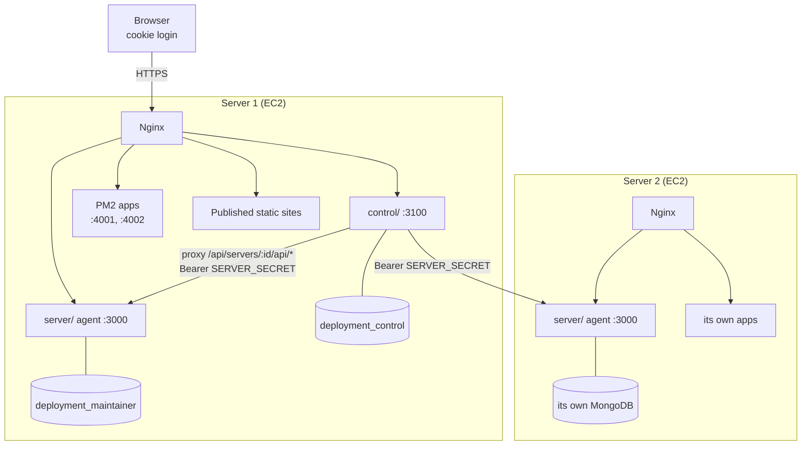
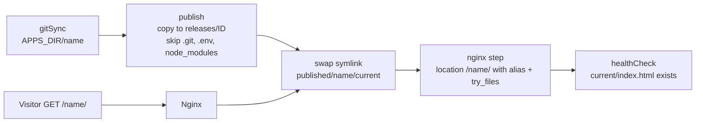
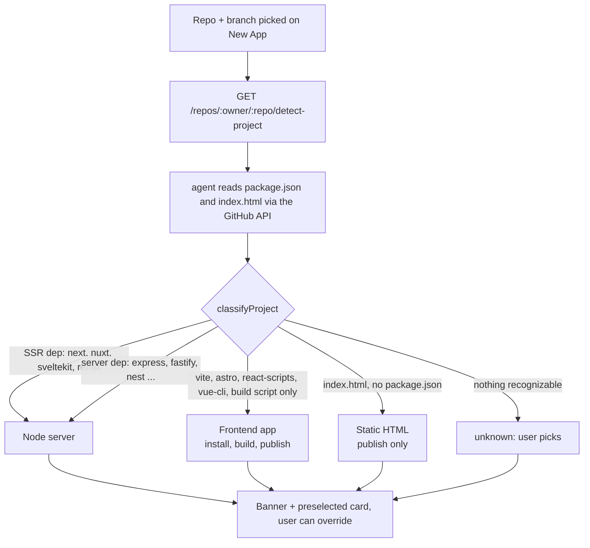
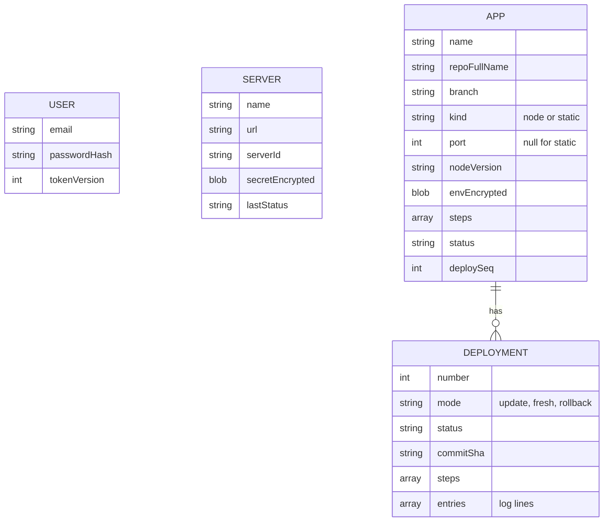
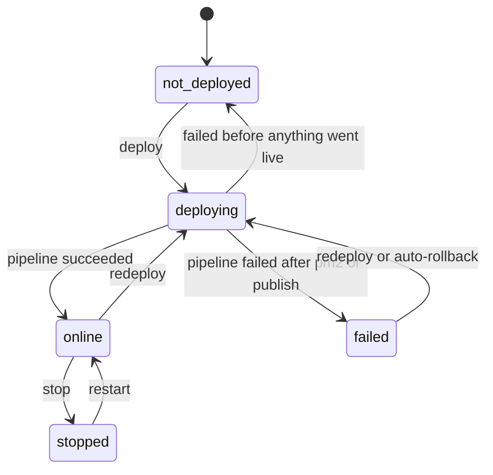
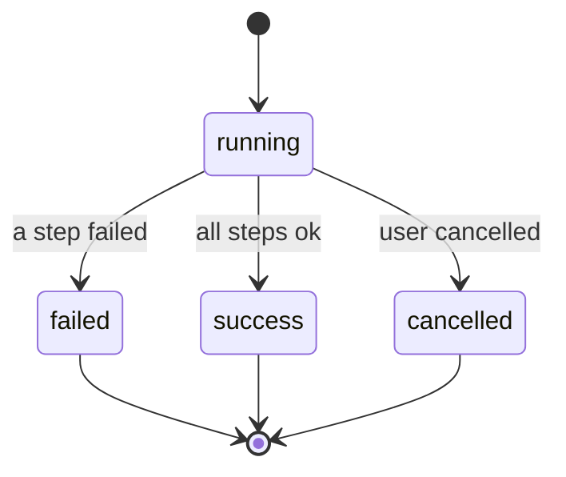

# Architecture

## 1. The big picture

- **One control plane**, many agents. Each managed server runs its own agent, its own MongoDB data,
  its own Nginx, and its own PM2.
- The control plane never runs deploys. It authenticates the human, then relays requests to the agent.
- Each agent never talks to a human. It authenticates only the control plane (via a shared secret).

## 2. Components

### 2.1 `web/` (the UI)
A single-page React app. Routes:

| Route | Page |
|---|---|
| `/login` | Login |
| `/` | Servers list (add, rename, rotate secret, remove) |
| `/settings` | Account (change dashboard password) |
| `/s/:serverId` | Apps on that server (cards) |
| `/s/:serverId/new` | Create app: repo, branch, Node version, env, steps |
| `/s/:serverId/apps/:id` | App detail with tabs (overview, env, steps, deployments, logs…) |
| `/s/:serverId/deployments`, `/deployments/:id` | Global deploy history, and one deploy with live log and step timeline |
| `/s/:serverId/ports` | Ports/routing overview |
| `/s/:serverId/server`, `/server/settings` | Server health (CPU/RAM/disk), GitHub token status, config export/import |

Everything under `/s/:serverId/...` talks to `api.apps.*`, `api.deployments.*` and so on. These all go
through `web/src/api.js` to `/api/servers/:id/api/...` on the control plane. `ServerContext` supplies the
current server, a bound `api` client and a `serverPath()` helper.

### 2.2 `control/` (control plane)
- **Auth**: one admin `User` (seeded by `npm run seed`). Login issues a JWT in an httpOnly cookie
  (`dm_session`, 7 days). The JWT carries a `tokenVersion`, so changing the password invalidates other sessions.
- **Server registry**: `Server` documents hold `name`, `url`, `serverId`, and `secretEncrypted`
  (AES-256-GCM using the control plane's `ENCRYPTION_KEY`).
- **Registration is verified**: before saving, it calls the agent's public `GET /deployment-manager`
  (checks the `serverId` matches) and then `GET /api/auth/check` with the secret.
- **Streaming proxy** (`routes/proxy.js`): `ANY /api/servers/:id/api/*` →
  `<server.url>/api/*`, adding `Authorization: Bearer <decrypted secret>`. It mounts before
  `express.json()` so bodies stream through, and SSE/downloads stream unbuffered. Only a few headers are
  forwarded; the browser's cookie never reaches the agent. An upstream 401 becomes a 502 so the UI's
  "401 = logged out" rule is never triggered by a bad agent secret.
- **Status cache**: per-server online/offline/unauthorized, cached 15s.
- **Static hosting**: serves `web/dist` if present (same-origin deployment).

### 2.3 `server/` (the agent)
Express API, Bearer-auth on everything under `/api` except `/api/health`.

| Layer | What lives there |
|---|---|
| `routes/` | HTTP surface: apps CRUD, deploy/restart/stop, deployments + SSE, repos (GitHub), ports, node versions, system stats, settings, config export/import |
| `services/deployer.js` | The engine: lock, pipeline runner, cancel, rollback, auto-rollback, crash recovery |
| `steps/` | One module per pipeline step, all exposing `run(ctx)` and `label(config)` |
| `services/git.js, pm2.js, nginx.js, node.js, shell.js` | Wrappers over git, PM2, Nginx+sudo, fnm, and `spawn` |
| `services/deployLog.js` | Buffered, redacted, capped log writer + event bus for live streaming |
| `services/monitor.js` | Background timers: system samples (30s) and app health pings (60s) |
| `models/` | `App` (config, steps, env blob, port, status) and `Deployment` (steps, log entries, status) |

### 2.4 Nginx (per server)
Two kinds of site:
- **Agent site** (`deploy/nginx-server.conf`): `/api/` and `/deployment-manager` → `:3000`,
  `/api/deployments` unbuffered for SSE, `/` is a 404, and `include /etc/nginx/deployer-apps/*.conf`.
- **Control site** (`deploy/nginx-control.conf`, server 1 only): `/` → `:3100`, SSE path unbuffered.
- **Per-app routes**: the agent writes `/etc/nginx/deployer-apps/<app>.conf` containing
  `location /<app>/ { proxy_pass http://127.0.0.1:<port>/; }`. Nginx picks the longest matching prefix,
  so `/<app>/` beats the catch-all. With `stripPrefix` (default) the app sees `/x`, not `/<app>/x`.
  Reloads go through a narrow sudoers rule (only `nginx -t` and `systemctl reload nginx`).

### 2.5 Static sites (no process)

A Node app is proxied to a port. A **static** app has no process: the `publish` step copies the folder
containing `index.html` into a new release directory, atomically swaps a `current` symlink, and Nginx serves
that folder with `alias`.

- Releases live in `PUBLISHED_DIR/<app>/releases/<deployment>`; the last 5 are kept.
- `PUBLISHED_DIR` must be readable by the nginx user. On Ubuntu `/home/ubuntu` is mode 750, so use a path like
  `/var/www/deployer` in production.
- The `publish` step's `staticDir` can be `auto`: after a build it picks the first of `dist`, `build`, `out` that contains `index.html`; without a build it uses the repo root. If none has a page, the deploy fails with a message saying where it looked.
- Static apps have no port, no PM2 process, no restart/stop and no runtime logs.

## 3. Data model

`USER` and `SERVER` live in the control plane database. `APP` and `DEPLOYMENT` live in each agent's database.

Details:

**Control plane DB**
- `User { email, passwordHash, tokenVersion }`
- `Server { name, url, serverId, secretEncrypted, version, hostname, lastSeenAt, lastStatus }`

**Agent DB**
- `App { name, repoFullName, branch, kind, port, nodeVersion, envEncrypted, steps[], status, health, currentCommitSha, lastDeployedAt, deploySeq }`
  - `steps[]` is the ordered pipeline: `{ type, enabled, config }`
  - `status`: `not_deployed | deploying | online | stopped | failed`
- `Deployment { appId, number, branch, commitSha, previousSha, mode, status, steps[], entries[], error, finishedAt }`
  - `mode`: `update | fresh | rollback`; `status`: `queued | running | success | failed | cancelled`
  - `entries[]` is the log (capped around 1 MB); only the newest 50 deployments per app are kept.

### App and deployment states

## 4. Security design

| Concern | Mechanism |
|---|---|
| Human login | bcrypt (cost 12), JWT in httpOnly `SameSite=Lax` cookie, `Secure` in production, login rate limit 10/15min, constant-time-ish unknown-email path |
| Control plane → agent | `SERVER_SECRET` (32+ chars) as a Bearer token; compared with `timingSafeEqual` on SHA-256 digests; failed attempts rate-limited 20/15min per IP, valid secret never limited |
| Secrets at rest | AES-256-GCM: agent encrypts app env with its `ENCRYPTION_KEY`; control plane encrypts server secrets with its own key |
| CSRF | `originCheck`: state-changing requests must come from an allowed UI origin or the server itself |
| CORS | Only when the UI is on another origin (e.g. Vercel), exact-match allowlist via `CORS_ORIGINS` |
| Command injection | `shell:false` everywhere; `tokenizeCommand` rejects pipes/`;`/`&`/redirects; branch, owner, repo, sha, port, path and env key names are validated |
| GitHub token | Passed per-invocation as `-c http.extraheader=…`, so it never lands in `.git/config`; redacted in logs |
| Log redaction | Env values (4+ chars, not common words) and the token are replaced with `••••` in stored logs |
| Privilege | The agent runs as `ubuntu`, with sudo limited to `nginx -t` and `systemctl reload nginx` |

## 5. Design decisions worth knowing

- **Single process, in-memory lock.** `runningByApp` prevents two deploys of one app. Therefore never run
  PM2 cluster mode or multiple instances of the agent or control plane.
- **Pipeline as data.** Steps are stored per app, ordered, individually toggleable, and open to custom
  commands. Adding a step type means adding a module in `steps/` and a schema in `steps/index.js`.
- **Agents are stateless to humans.** No users, no CORS, no UI on agents. All trust is one shared secret.
- **Apps live under the agent's domain** as path prefixes, not subdomains.
- **Recovery on restart.** At boot, any deployment left `queued/running` is marked failed ("Dashboard restarted during deploy").
