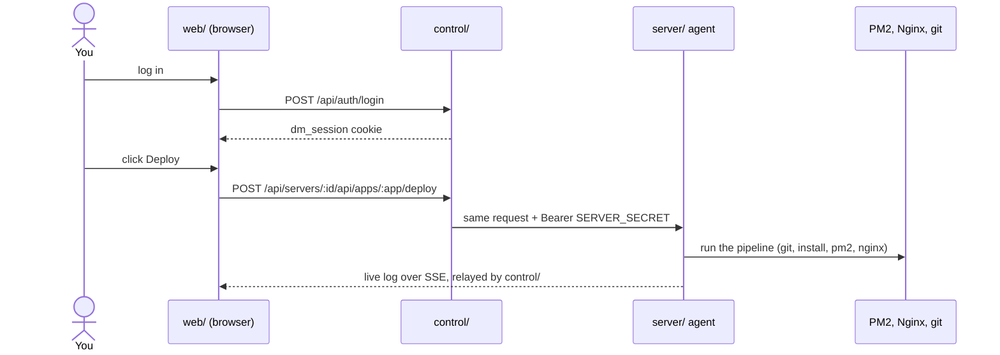
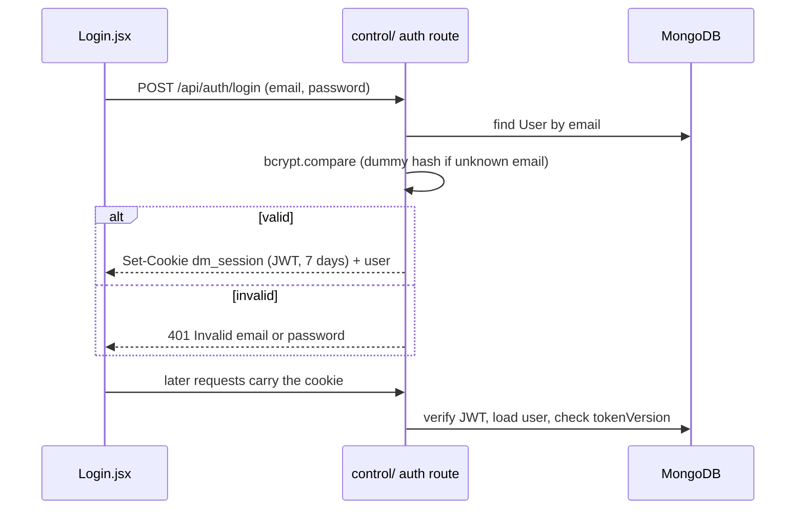
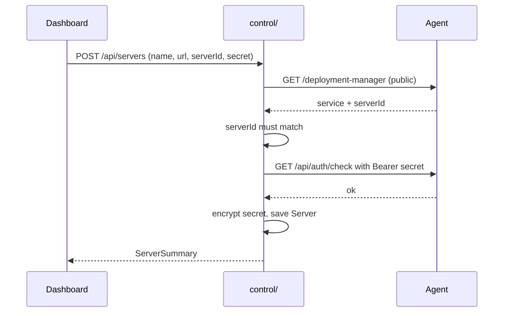
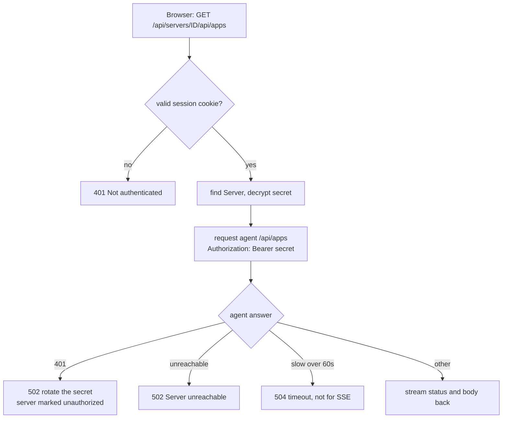
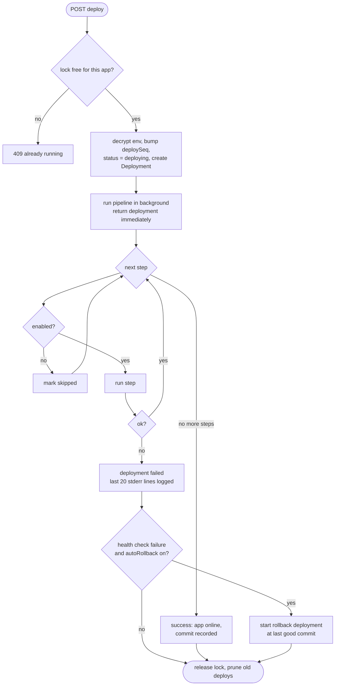
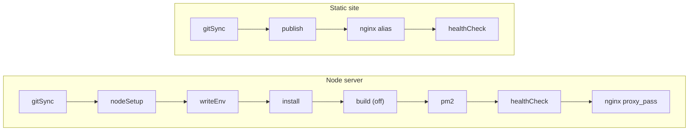
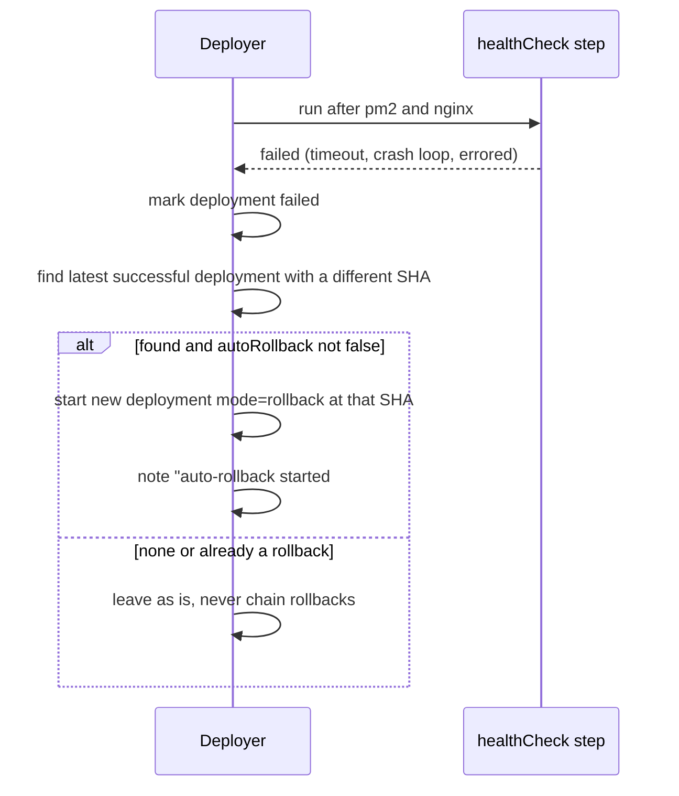
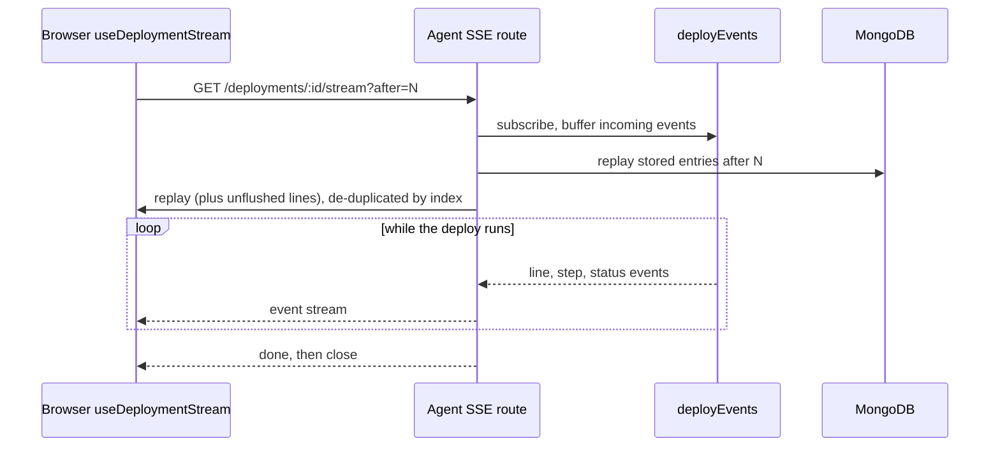
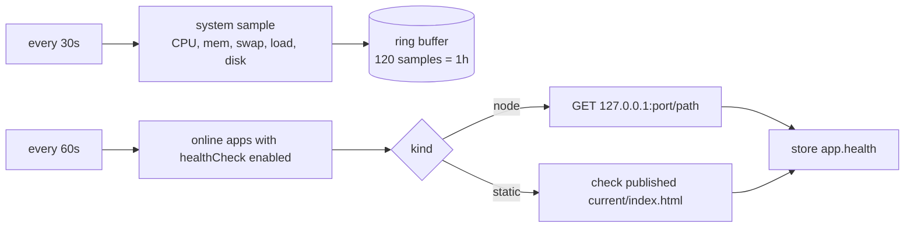

# How it works

Concrete flows, each tied to the code that does it.

## 0. The whole thing on one page

## 1. Logging in

1. `web/src/pages/Login.jsx` → `POST /api/auth/login` `{ email, password }` on the control plane.
2. `control/src/routes/auth.js` finds the `User`, runs `bcrypt.compare` (even for unknown emails, against a dummy hash, so timing is similar), and on success `issueSessionCookie` sets `dm_session`.
3. Later requests pass `requireAuth` (`control/src/middleware/auth.js`): verify JWT, load the user, check `tokenVersion` matches.
4. Any 401 from the control plane makes `web/src/api.js` fire a "session expired" event that sends you to `/login`.

## 2. Adding a server

1. On the new box you configure its agent `.env` with a `SERVER_ID` and `SERVER_SECRET`.
2. In the dashboard: **Add Server** → name, URL, ID, secret → `POST /api/servers`.
3. `control/src/services/agentClient.js` calls `GET <url>/deployment-manager` (public). It must answer `{ service: 'deployment-maintainer', serverId }` with the matching ID. Then it calls `GET <url>/api/auth/check` with the secret.
4. Only after both checks pass is the `Server` saved, with the secret encrypted.
5. Rotating a secret works the same way: verify the new one against the agent first, then replace.

## 3. A request through the proxy

Browser asks for `GET /api/servers/<id>/api/apps`:

1. Control plane auth (cookie) → look up `Server` → decrypt the secret.
2. Build the upstream path `/api/apps` (each segment URL-encoded; `.` and `..` rejected).
3. Open an HTTP(S) request to the agent with `Authorization: Bearer <secret>`, pipe the response back.
4. Agent's `requireAuth` checks the bearer token and the route runs.

Errors: unreachable → 502; slow (60s, not applied to SSE) → 504; agent says 401 → 502 "rotate the secret" and the server is marked `unauthorized`.

## 4. Creating an app

`POST /api/apps` on the agent (`server/src/routes/apps.js`):

1. Validate the name, repo, branch, Node version, port, env keys and values.
2. Port: use the one given (checked for conflicts and that nothing on the machine is listening), or `allocatePort` (first free from `APP_PORT_START`, default 4001).
3. Steps: `normalizeSteps` validates your pipeline, or `defaultSteps(name)` supplies it:

   `gitSync → nodeSetup → writeEnv → install → build (off) → pm2 → healthCheck → nginx(/<name>)`

   `gitSync` must be first and `nodeSetup` must exist; both are always enabled.
4. Env is encrypted into `envEncrypted`. The `App` is saved as `not_deployed`.
5. If `deploy: true`, a deployment starts immediately.

## 5. A deploy, step by step

Entry point: `POST /api/apps/:id/deploy` → `startDeployment` in `server/src/services/deployer.js`.

**Before the pipeline**
1. **Lock**: reserve `runningByApp[appId]` synchronously. A second deploy → 409.
2. Decrypt the env first, so a wrong `ENCRYPTION_KEY` fails early without touching state.
3. Increment `deploySeq` (this is deploy "#N"), set app `status = deploying`.
4. Create the `Deployment` document with one entry per step (`id` like `3-writeEnv`).
5. Build the redaction list (GitHub token + env values) and a `deployLog`.
6. Run the pipeline in the background, and return the deployment immediately so the UI can start streaming.

**The pipeline** (`runPipeline`): for each step in order,
- If the step is disabled, mark it `skipped` and log `– <label> · disabled` (the nginx step is still invoked so it can remove a stale route).
- Otherwise mark `running`, emit events, call `REGISTRY[type].run(ctx)`, then mark `success` or `failed`.
- If the abort signal fired, the deploy is `cancelled`.
- Steps share a `state` object (`state.appDir`, `state.binDir`, `state.sha`).

**What each step does**

| Step | Action |
|---|---|
| `gitSync` | `git clone --branch X --single-branch` (first time) or `fetch` + `checkout -B` + `reset --hard origin/X` (or a specific SHA for rollback). `fresh` mode deletes the folder first. Records the commit SHA. |
| `nodeSetup` | `fnm install <version>` if missing; resolves the Node bin dir so PM2 can run with the right Node |
| `writeEnv` | Writes `.env` (mode 600), single-quoted values, plus `PORT` |
| `install` | `npm ci` if there's a lockfile, else `npm install` (or your command), under `fnm exec` |
| `build` | Your build command (off by default) |
| `custom` | Any command you add, run in the app dir |
| `pm2` | Writes `ecosystem.config.cjs` (script, args, cwd, env + `PORT` + PATH with the Node bin dir), then `pm2 startOrReload … --update-env` and `pm2 save` |
| `healthCheck` | Polls `http://127.0.0.1:<port><path>` until a 200–399 response, up to a timeout (default 60s, every 2s). Fails fast if PM2 reports `errored`, or the restart count rises by 3 (a crash loop). |
| `nginx` | Renders the `location` block, writes `<NGINX_APPS_DIR>/<name>.conf`, runs `sudo nginx -t` then `sudo systemctl reload nginx`; on failure it restores the previous file. Skipped if `NGINX_ENABLED=false`. |

**Node vs static pipelines**

For a static app the `publish` step is where the new version goes live (the symlink swap), the same way
`pm2` is for a Node app. The health check then confirms `index.html` is in the live release.

**Finishing**
- Success: deployment `success`, app `online`, `currentCommitSha` and `lastDeployedAt` set.
- Failure: deployment `failed` with the error, app `failed` (if PM2 already ran) or its previous status (if the old version is still serving). The last 20 stderr lines are appended to the log.
- The lock is always released and old deployments pruned (keep 50 per app).

## 6. Auto-rollback and manual rollback

- **Auto**: if the failure came from the health check, and the step's `autoRollback` isn't `false`, and an earlier successful deployment exists with a different SHA, the deployer starts a new deployment in `rollback` mode at that SHA, and notes `auto-rollback started: deployment #N` on the failed one. It never chains a rollback off a failed rollback.
- **Manual**: `POST /api/deployments/:id/rollback` on a successful deployment with a recorded SHA.

- A rollback runs the **whole pipeline** (reinstall, restart…) pinned to that commit, using the **current** env and steps, not the old ones.

## 7. Live logs (Server-Sent Events)

1. The step runners write through `deployLog` (`log.info`, `log.cmd`, `log.onLine(stepId)`): redact secrets, cap at ~1 MB, buffer, and flush to Mongo every 500 ms, while emitting `line`, `step`, `status`, `done` events on an in-process `EventEmitter`.
2. `GET /api/deployments/:id/stream?after=<i>` (`routes/deployments.js`):
   subscribes to the emitter first and buffers, **then** replays stored entries (plus any not-yet-flushed ones), then drains the buffer de-duplicating by entry index. No gap, no duplicates.
3. Sends a heartbeat comment every 15s, and `done` when the deploy ends.
4. The browser hook `useDeploymentStream` consumes it. Nginx and the control proxy have buffering turned off for these paths, otherwise logs would arrive in lumps.

## 8. Monitoring

`server/src/services/monitor.js`, started at boot:
- Every **30s**: a system sample (CPU, memory, swap, load, disk) kept in a 120-sample ring buffer (1 hour).
- Every **60s**: for each app that is `online` **and** has an enabled health-check step, a GET on its health path (5 s timeout, 5 at a time); the result is stored in `app.health` and shown as healthy/unhealthy on the cards.

## 9. Everything else the agent does

- **Repos** (`routes/repos.js`, `services/github.js`): lists your GitHub repos and branches with `GITHUB_TOKEN`, and suggests a Node version from the repo (`.nvmrc` / `engines`).
- **Ports** (`routes/ports.js`): a table of ports, apps, routes and conflicts.
- **Restart / stop / logs**: PM2 commands for an app; `logs` returns `pm2 logs --nostream`.
- **Duplicate**: clone an app's config onto another branch and port (optionally copying env).
- **Delete**: needs the app's name typed; stops PM2, removes the Nginx route and the folder.
- **Config export/import**: encrypts apps with a passphrase (scrypt + AES-GCM) so you can move apps between servers; import previews name/port conflicts first.
- **Shell safety** (`services/shell.js`): `spawn` with `shell:false`, a 200 KB output cap, and abort via signal then SIGKILL after 5s.

## 10. Startup and shutdown (agent)

1. Load and validate config (fails with a readable list of problems).
2. Connect Mongo, then `recoverInterruptedDeployments` (mark any stuck run as failed).
3. Start the monitor, then listen.
4. On SIGINT/SIGTERM (PM2 reload sends SIGINT): stop the monitor, drain connections, disconnect Mongo, exit.
