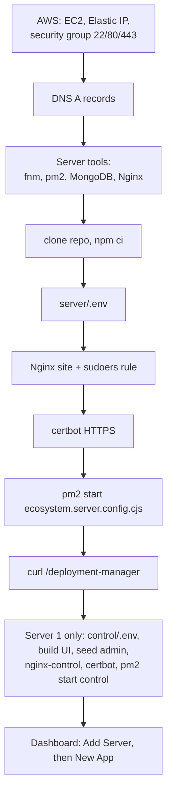

# Setup

Two parts: run it on your machine (development), and the shortened production recipe. The complete,
copy-pasteable production guide is [../DEPLOYMENT.md](../DEPLOYMENT.md) (and [../deployment-helper.md](../deployment-helper.md)).

## Part A: Local development

### Prerequisites
- Node 20+ and npm
- MongoDB on `127.0.0.1:27017` (local install or Docker)
- For **real** deploys locally: `fnm` and `pm2`. The test suite doesn't need them (it uses fakes).

```bash
docker run -d --name mongo -p 27017:27017 mongo:7     # one way to get MongoDB
```

### 1. Install
```bash
cd deployment_maintainer
npm install            # installs all three workspaces
```

### 2. Configure the agent (`server/.env`)
```bash
cp server/.env.example server/.env
node -e "console.log(require('crypto').randomBytes(32).toString('hex'))"   # use for ENCRYPTION_KEY
```
Set at least:

| Variable | Dev value |
|---|---|
| `SERVER_ID` | `local-server-1` (8–64 chars: letters, digits, `_`, `-`) |
| `SERVER_SECRET` | any 32+ character string |
| `ENCRYPTION_KEY` | 64 hex characters (command above) |
| `NGINX_ENABLED` | `false` (the nginx step then logs "skipped") |
| `APPS_DIR`, `NGINX_APPS_DIR` | folders under `./.data`, e.g. `/abs/path/.data/apps`, `/abs/path/.data/nginx` |
| `GITHUB_TOKEN` | optional until you want to list or clone real private repos |
| `PUBLISHED_DIR` | optional; where static sites are published (defaults beside `APPS_DIR`) |

Other defaults: `PORT=3000`, `APP_PORT_START=4001`, `DEFAULT_NODE_VERSION=20`, `MONGO_URI=mongodb://127.0.0.1:27017/deployment_maintainer`.

### 3. Configure the control plane (`control/.env`)
```bash
cp control/.env.example control/.env
```
Set `JWT_SECRET` (32+ chars), its **own** `ENCRYPTION_KEY`, `ADMIN_EMAIL`, `ADMIN_PASSWORD`, and keep
`MONGO_URI=mongodb://127.0.0.1:27017/deployment_control`. `ALLOW_INSECURE_SERVER_URLS` is only needed for
plain-`http` non-localhost agents. `CORS_ORIGINS` is only needed when the UI runs on another origin.

### 4. Create the admin and start everything (three terminals)
```bash
npm run seed            # creates/resets the admin user from control/.env
npm run dev             # agent        → :3000
npm run dev:control     # control plane → :3100
npm run dev:web         # Vite UI       → :5173 (proxies /api to :3100)
```

### 5. Use it
1. Open http://localhost:5173 and log in with the admin email/password.
2. **Add Server** → URL `http://localhost:3000` → choose "I already have an ID and secret" → enter `SERVER_ID` and `SERVER_SECRET` from `server/.env`.
3. Open the server, **New app**, pick a repo and branch, and **Deploy**.

### Tests and build
```bash
npm test                # all workspaces (server 193, control 53)
npm run build           # builds web/dist (the control plane serves it in production)
npm run clear-db        # drop the agent DB (asks to confirm)
npm run clear-db:control
```

### Root scripts
`dev`, `dev:control`, `dev:web`, `start`, `start:control`, `seed`, `clear-db`, `clear-db:control`, `test`, `build`.

---

## Part B: Production (short version)

Detailed commands are in DEPLOYMENT.md. The shape of it:



### Per server (the agent)
1. **AWS**: Ubuntu 24.04 EC2 (t3.small+), 30 GB disk, Elastic IP, security group with only 22 (your IP), 80 and 443. Never open 3000, 3100, 4001+ or 27017.
2. **DNS**: an A record per agent domain (e.g. `api.example.com`); plus one for the dashboard on server 1.
3. **GitHub token**: fine-grained, Contents + Metadata read-only.
4. **Install**: packages + swap, `fnm`, `pm2` (+ logrotate), MongoDB (or Atlas), clone this repo.
5. **`server/.env`**: `SERVER_ID`, `SERVER_SECRET`, `ENCRYPTION_KEY`, `GITHUB_TOKEN`, `APPS_DIR=/home/ubuntu/apps`, `NGINX_APPS_DIR=/etc/nginx/deployer-apps`, `NGINX_ENABLED=true`, `NODE_ENV=production`.
6. **Static site folder** (only if you deploy static sites): `sudo mkdir -p /var/www/deployer && sudo chown ubuntu:ubuntu /var/www/deployer`, then set `PUBLISHED_DIR=/var/www/deployer` in `server/.env`. Nginx cannot read under `/home/ubuntu` (mode 750).
7. **Nginx**: install `deploy/nginx-server.conf` (replace `YOUR_SERVER_DOMAIN`), create `/etc/nginx/deployer-apps`.
8. **sudoers**: install `deploy/sudoers-deployer` so `ubuntu` can run `nginx -t` and `systemctl reload nginx`.
9. **HTTPS**: `sudo certbot --nginx -d YOUR_SERVER_DOMAIN`.
10. **Start**: `pm2 start deploy/ecosystem.server.config.cjs`, then `pm2 save` and `pm2 startup` to survive reboots.
11. **Check**: `curl https://YOUR_SERVER_DOMAIN/deployment-manager` returns `{ service, serverId, version }`.

### Once (the control plane, on server 1)
1. `control/.env`: `JWT_SECRET`, `ENCRYPTION_KEY`, `ADMIN_EMAIL`, `ADMIN_PASSWORD`, `NODE_ENV=production` (cookie becomes `Secure`, so HTTPS is required).
2. `npm run build && npm run seed`.
3. Install `deploy/nginx-control.conf`, certbot the dashboard domain.
4. `pm2 start deploy/ecosystem.control.config.cjs`.
5. Log in, **Add Server**, and paste the agent's `SERVER_ID` and `SERVER_SECRET`.

Alternative: host `web/` on Vercel with `VITE_API_URL` pointing at the control plane,
and set the control plane's `CORS_ORIGINS` to the Vercel origin.

### Adding another server
Repeat the "per server" steps on the new EC2, then **Add Server** in the dashboard with its URL, ID and secret.

### Updating
`git pull`, `npm ci`, `npm run build` (if the UI changed), then `pm2 restart deployment-maintainer deployment-control`.
(Restarting the agent mid-deploy fails that deploy; it is marked failed on the next boot.)

### Common first-deploy checks for an app
- It must listen on `process.env.PORT` (the deployer injects it).
- `npm start` must work after the install step; if it needs a build, enable the Build step.
- Needed env vars must be in the app's env list.
- Pick a health-check path that returns 200–399, or turn the health check off for that app.
- Give every app a unique Nginx path (the default is `/<app-name>`).

### Troubleshooting pointers
| Symptom | Look at |
|---|---|
| "crash loop detected" | `pm2 logs app-<name> --lines 50 --nostream` on the server. The app's own error is there. |
| Server shows `unauthorized` | `SERVER_SECRET` in the agent's `.env` doesn't match what the dashboard stored; rotate it |
| Server shows `offline` | Nginx, PM2, DNS or firewall; try `curl https://<agent>/deployment-manager` |
| Logs arrive in lumps | Nginx or proxy buffering on the SSE path; compare with `deploy/*.conf` |
| Login works but you bounce back to login | `NODE_ENV=production` without HTTPS (the cookie is `Secure`) |
| App can't be reached at `/<name>/` | Nginx step disabled, `nginx -t` failed, or two apps share one path |
